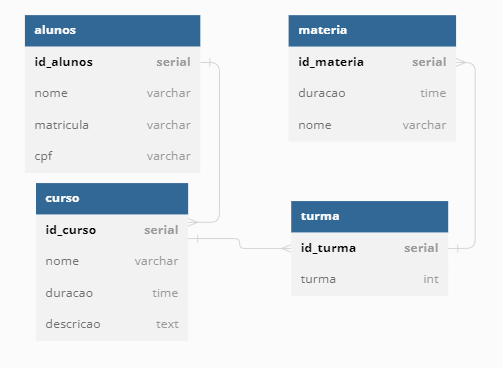

# Banco_de_Dados
Projeto Individual MOD. 4

##  - Descrição do Projeto 
A Resilia está analisando lançar um novo sistema de
acompanhamento e precisa de ajuda para modelar um
banco de dados que vai armazenar seus cursos, turmas e alunos.
Recebemos uma tarefa de realizar essa modelagem e responder algumas perguntas para contribuir nesse sistema. 

## ⇨ Existem outras entidades além dessas três?
Sim, matéria.

## ⇨ Quais são os principais campos e tipos?
São os campos que contém ID, NOME e CPF que correspondem INT , VARCHAR e CHAR.

## ⇨ Como essas entidades estão relacionadas?
Aluno está relacinado a cursos, podendo estar em diversos cursos;
Cursos está relacionado a turmas;
Turmas está relacionado a matéria.

## Dbdiagram

